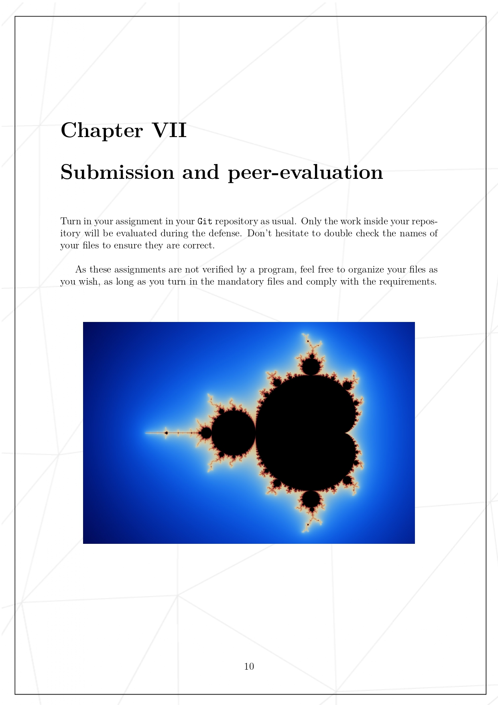
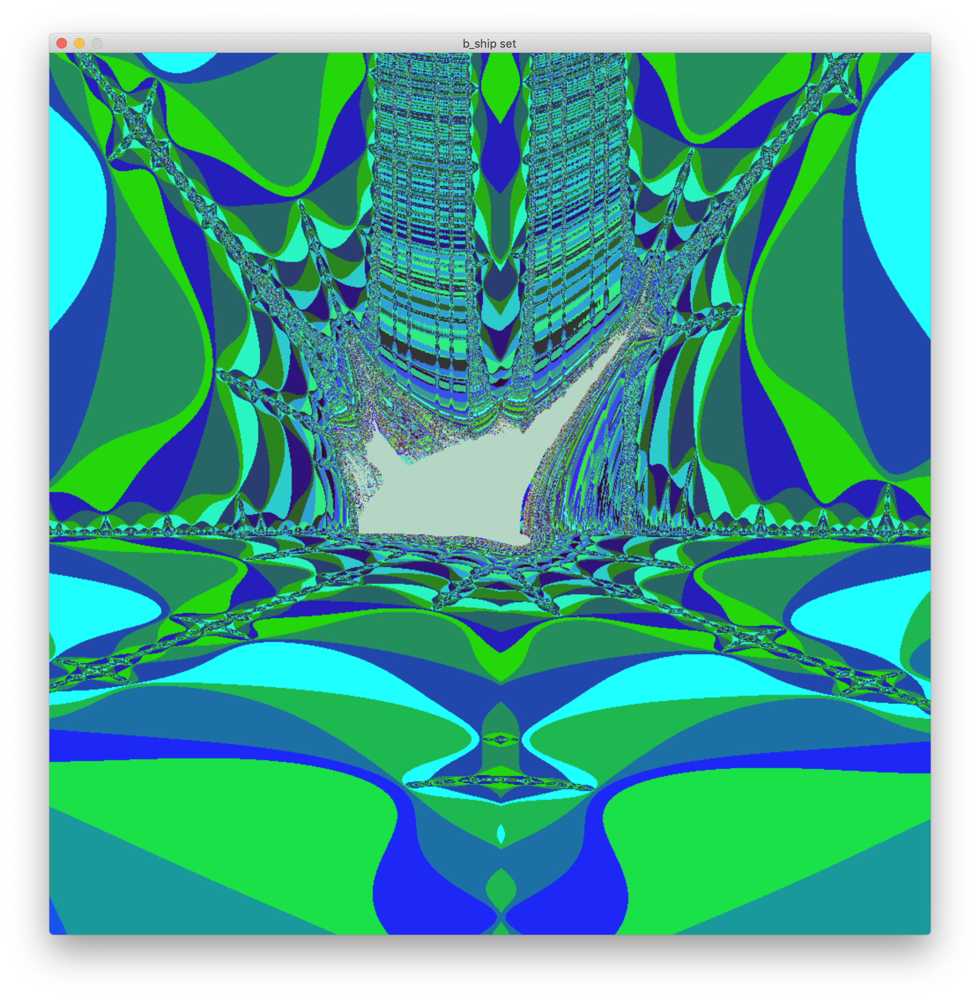

# FRACT-OL

# Introduction to Fractals

Fractals are mathematical objects that have the property of self-similarity at different scales. They are often characterized by their repeating patterns and intricate shapes. Some famous examples of fractals include the Mandelbrot set and the Julia sets ...

## Equations of Fractals

Here are the equations for some popular fractals:

### Mandelbrot Set

The equation for the Mandelbrot set is:

Z_{n+1} = Z_n^2 + C

where `Z_0 = 0` and `C` is a constant.

### Julia Sets

The equation for a Julia set is similar to the Mandelbrot set, with a fixed value for `C`:

Z_{n+1} = Z_n^2 + C

where `Z_0` can be any complex number and `C` is a constant.

### Burning Ship Fractal

The equation for the Burning Ship fractal is:

Z_{n+1} = abs(Z_n)^2 + C

Z_{n+1} = abs(Z_n)^2 + C

where `Z_0 = 0` and `C` is a constant.

### Tricorn Fractal

The equation for the Tricorn fractal is:

Z_{n+1} = conjugate(Z_n^2) + C

where `Z_0 = 0` and `C` is a constant. The `conjugate` function returns the complex conjugate of a complex number.

## Coloring Functions

In order to create an image of a fractal, it is necessary to iterate the equation for each pixel in the image. To do this, we use a relative function to determine if a point `C` belongs to the fractal set. If the magnitude of `Z_n` exceeds a certain threshold, it is considered to be outside of the set and is colored accordingly. If the magnitude remains below the threshold after a certain number of iterations, it is considered to be inside the set and is also colored.

# Conclusion

Fractals are fascinating mathematical objects that are capable of generating intricate patterns and shapes. By iterating the equations for different fractals and using relative functions, it is possible to generate beautiful images of these sets. Whether you are a math enthusiast or just enjoy exploring the world of computer graphics, learning about fractals is a fun and rewarding experience.

# Examples

## Mandelbrot set

## Julia set

## Burning ship set

## Tricorn set

